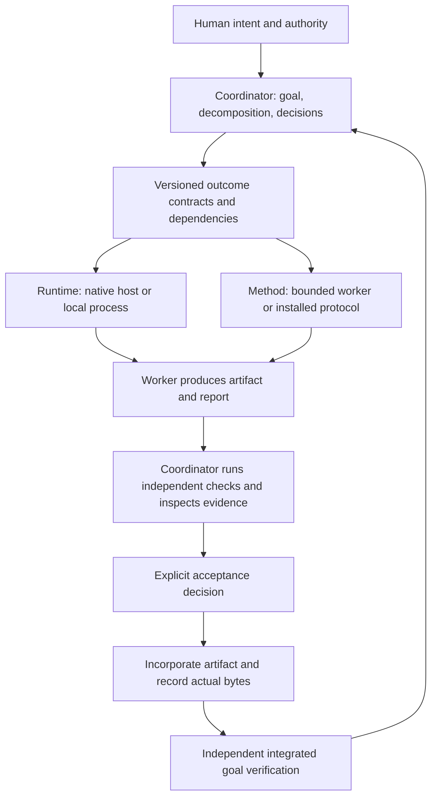

# Outcome-centered coordination

The stable unit is an authorized outcome: what must become true, why it matters,
who owns it, its dependencies, and what evidence permits acceptance. Model,
harness, transport, and engineering method are replaceable execution choices.

## Boundaries

`coord_state.py` remains the authoritative owner/revision store and completion
entry point. `coord_outcomes.py` owns protected contracts, assignment identity,
dependencies, verification, acceptance, integration, and the goal gate.
`coord_runtime.py` owns launch intent, host handles, process receipts, observations,
controls, and explicit reconciliation. `coord_protocol.py` resolves engineering
methods; selected method text is pinned to an attempt. `coord_process.py` handles
bounded local checks and process-group settlement. No runtime or protocol can
authorize acceptance merely by declaring itself finished.

An assignment gets one accountable coordinator, one current contract identity,
and at most one recorded attempt. It may have multiple historical versions.
Uncertain delivery remains uncertain until inspection establishes what happened;
it never automatically dispatches a replacement. Changes to an outcome issue a
new identity and invalidate its transitive dependents. Changes to the goal or
authority require explicit replanning after existing attempts settle.

Persistent records are the existing task JSON with an opt-in `outcome_plan`.
Attempt files retain the assignment, method snapshot, pinned report publisher,
logs, report hashes, and receipts. Worker reports are inputs to inspection;
accepted evidence is bound to current assignment, dependencies, artifact bytes,
check results, and a coordinator decision. Recovery reads these records before
acting, including incorporation that happened before its checkpoint.

## Success criteria and release gate

| Criterion | Observable pass condition |
| --- | --- |
| Replaceability | Same outcome/authority/checks run through native and process runtimes, with ordinary and installed-protocol methods. |
| Separate acceptance | Worker completion or an `accepted` claim cannot accept, integrate, or complete a task. |
| Evidence identity | Old assignment/attempt/dependency reports and changed artifacts or reports are rejected. |
| Ownership | Wrong owner and stale revisions cannot start or mutate attempts or acceptance. |
| Recovery | Fresh processes reconcile persisted execution and incorporation; unknown delivery never auto-dispatches; explicit inspected settlement/non-delivery permits progress. |
| Dependency invalidation | Revising an outcome invalidates every transitive dependent while preserving unrelated outcomes. |
| Integrated goal | Locally successful outcomes cannot complete when the independent integrated check fails or blockers, decisions, or background work remain. |
| Authority | Assignments carry the authorized goal and bounded scope; out-of-workspace artifacts are rejected; workers escalate missing authority. |
| Runtime settlement | Terminal process receipts and timed-out checks leave no live member of their owned process group. |
| Compatibility | Existing records remain readable and all baseline tests continue passing without adoption or automatic migration. |
| Full skill in real use | A fresh agent reads the shipped Coordinator skill and completes a representative real repository task end to end; the parent independently checks the deliverable and original goal criteria. |

The deterministic gate exercises the negative cases, real subprocesses, fresh
CLI sessions, interruption windows, and completion/archive paths. Run:
`python3 -m unittest discover -s skills/coordinator/scripts -p 'test_*.py'`.

The runtime matrix gate requires twelve successful deliveries: two runtimes × two methods
× three repetitions. `evals/live_delivery.py` prepares isolated compatibility
tasks, emits native host requests, launches Term2 with the confirmed configured
route, and runs local and independent integrated checks. Coordinator inspects
the returned source before acceptance. The installed `architect` skill in this
gate is a representative evaluation protocol, not a pstack installation.

Zero observed false acceptance, false completion, unauthorized publication, and
automatic duplicate dispatch are required in these checks. Twelve runs establish
the boundary works on the exercised task; they do not establish a production
reliability rate or equivalence across arbitrary models and protocols.

Overall completion additionally requires
[Real-use verification](real-use-verification.md). Launch a fresh agent with the
shipped skill and a genuine authorized repository task. Inspect its actual
coordination, durable state, integration, and final deliverable, and independently
verify the original goal. Record the skill version, task, trace, checks, acceptance,
and limitations. The runtime matrix and tabletop cases support this gate; they
do not satisfy it. Keep completion pending until it passes or the user explicitly
waives it.

## First-version scope

Support durable file artifacts, cooperative agents, native host observations,
and Linux local process groups. Commands must not detach jobs or escape the
owned process group. Tool permissions and OS isolation belong to the host.
Coordinator must inspect semantics and authority; a non-empty decision string
records that judgment rather than replacing it. Legacy terminal/Herdr tasks
retain their existing lifecycle. Memory remains advisory and its sidecar paused.

Add another runtime or artifact representation only when real work needs it;
keep outcome identity, authority, acceptance, and integrated verification fixed.
